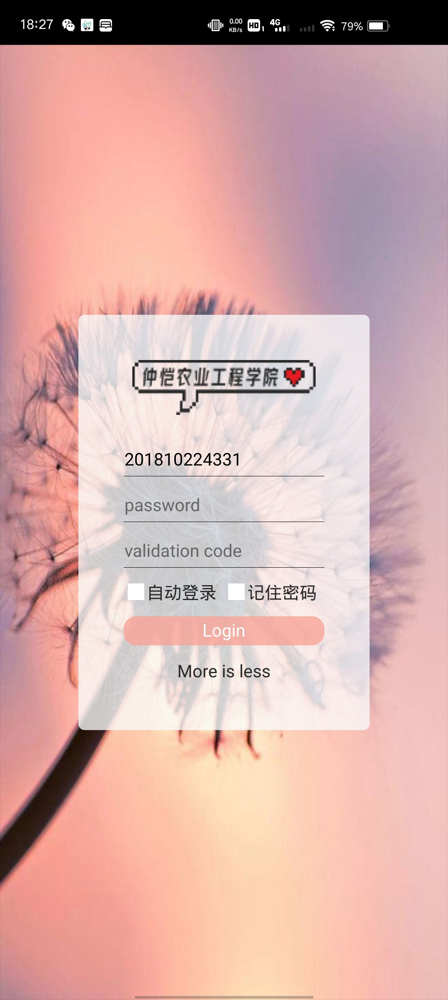
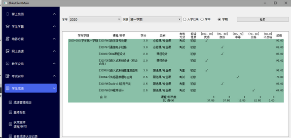
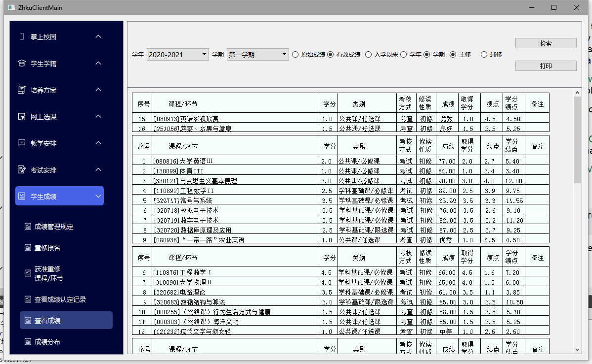
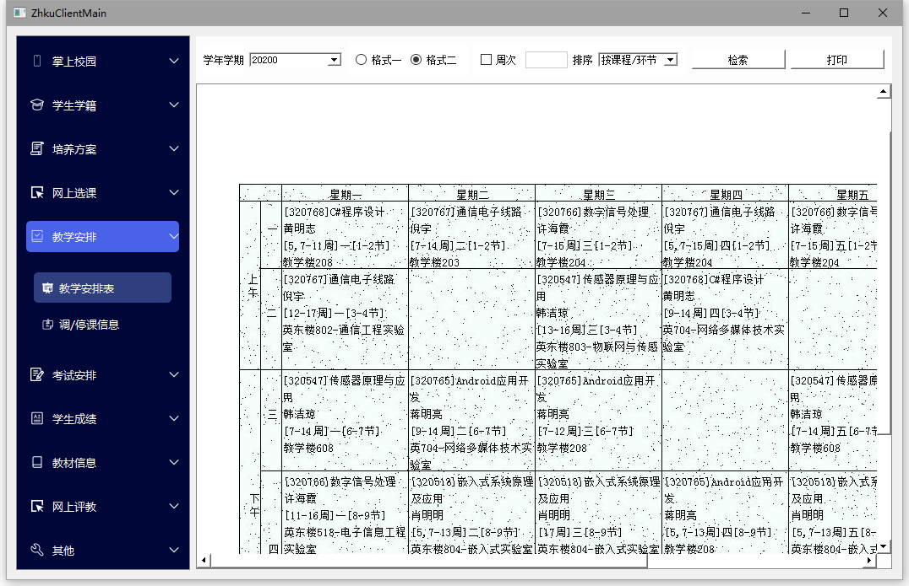
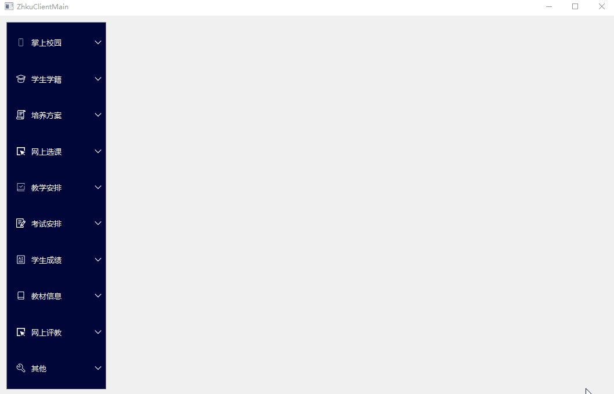
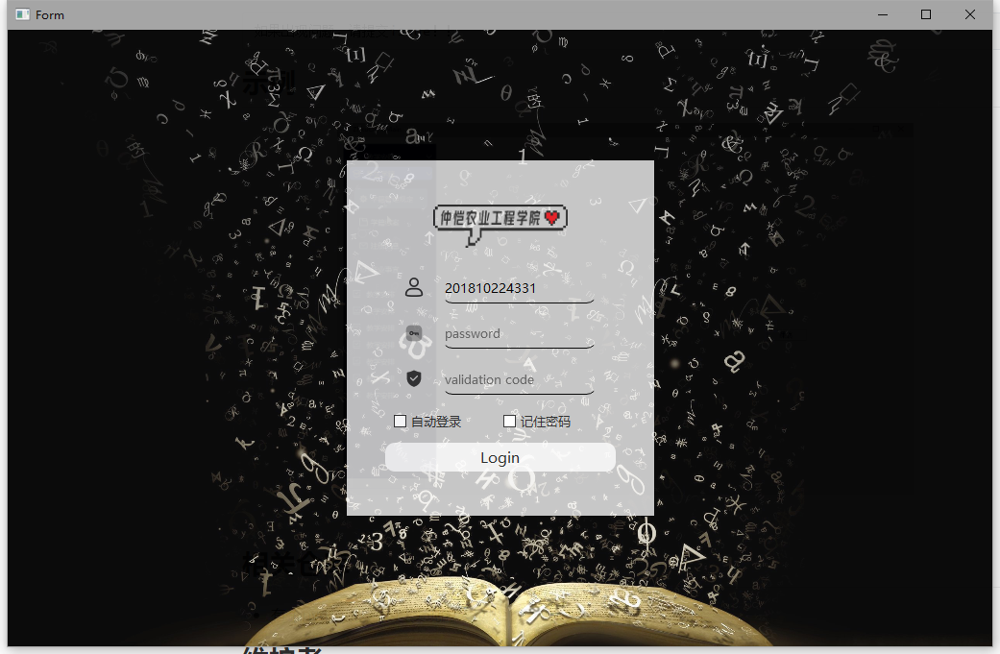

# Qt-Zhku-Client

没动力了,懒得动了,看缘分更新,明明很有时间,就是懒得动,草

[](.)

***

本仓库包含以下内容：

1. 重造的一个仲恺教务客户端，原本用python写的太烂了
2. 基于QT+爬虫形式，效率较低，没有官方API
3. 语法垃圾,实现的很笨,轻喷,喷就马上改

开发文章会在公众号更新

## TODO

- [x] 客户端功能
    - [x] 登录功能
    - [x] 自动登录
    - [x] 保存cookies
    - [x] 最小化托盘
    - [x] 查询全校课表
- [ ] 学生学籍
    - [ ] 学籍管理规定
    - [ ] 学籍档案
        - [ ] 基本信息
        - [ ] 辅修报名
        - [ ] 辅修信息
        - [ ] 奖惩信息
    - [ ] 注册信息
    - [ ] 学籍异动
        - [ ] 学业预警
        - [ ] 申请异动
        - [ ] 预计异动信息
        - [ ] 异动信息
    - [ ] 毕业事宜
        - [ ] 毕业进展
        - [ ] 申请提前/推迟毕业
        - [ ] 毕业审核结论
- [ ] 培养方案
    - [ ] 理论课程
    - [ ] 实践环节
    - [ ] 毕业学分要求
- [ ] 网上选课
    - [ ] 选课管理规定
    - [ ] 预选
    - [ ] 预选结果
    - [ ] 正选
    - [ ] 正选结果
    - [ ] 补选
    - [ ] 退选
    - [ ] 被取消课程
- [x] 教学安排
    - [x] 查询课表
        - [x] 类型一
        - [x] 类型二
    - [ ] 调/停课信息
- [ ] 考试安排
    - [ ] 考试管理规定
    - [ ] 申请补考
    - [ ] 申请缓考
    - [x] 考试安排表
    - [ ] 考试通报信息
- [x] 学生成绩
    - [ ] 成绩管理规定
    - [ ]  **重修报名** 
    - [ ]  **获准重修课程/环节** 
    - [ ] 查看成绩认定记录
    - [x] 查看成绩
        - [x] 自选参数
    - [x] 成绩分布
    - [x] 查看等级考试成绩
- [ ] 教材信息
    - [ ]  **领取教材信息** 
    - [ ]  **领取教材对帐** 
    - [ ]  **有售教材信息** 
    - [ ] 确认需要教材
- [ ] 网上评教
    - [ ] 质量评价管理规定
    - [ ] 提交问卷调查表
    - [ ] 调教教学评价表
- [ ] 其他
    - [ ] 修改个人密码
    - [ ] 查看个人登录日志
    - [ ] 文件下载
- [ ] 教室课表
- [ ] 培养方案

## 目录

- [更新](#更新)
- [背景](#背景)
- [安装](#安装)
- [示例](#示例)
- [相关仓库](#相关仓库)
- [维护者](#维护者)
- [如何贡献](#如何贡献) 
- [使用许可](#使用许可)

## 更新
- 2021年4月11日19:59:37 大更新
    - 更新了404页面
    - 优化了结构
- 2021年4月10日19:24:18 更新一下按钮图标
- 2021年4月9日18:05:49 修复bug
- 2021年4月9日13:17:57 更新安卓端
- 2021年4月2日16:39:25 做完了全校的课程安排
- 2021年3月22日19:51:56 添加 更多 页面
    - 可用于查询课程,教师课表等
- 2021年3月22日18:31:38 加入按钮响应样式
- 2021年3月20日13:34:49 发布release版本
    - 可以去右边的发行版试试
    - 或者来百度云盘
        - [链接: https://pan.baidu.com/s/1Rj6i-CLI8fdxsVVKsnk9EQ 提取码: it6p 复制这段内容后打开百度网盘手机App，操作更方便哦]()
- 2021年3月20日13:34:15 可以抓取课程类型二
    - 原来是粗心少写了个参数
- 2021年3月18日20:45:02 已经做完考试安排表,优化了一些结构
    - 使用了模板,挺好用的
    - 还可以进行更多的抽象
- 2021年3月18日14:21:49 正在做考试安排表
- 2021年3月18日13:36:31 降低复杂性,抽象成函数,优化结构
- 2021年3月18日13:13:10 将cookies.json 换成 .ini 形式了
- 2021年3月18日11:09:49 做好了等级考试查询
    - 自以为 优化了结构,用emit信号的方式替代了原来使用ui文件内容
- 2021年3月17日23:58:06 添加 .gitignore 增加登录逻辑
    - 记得搞一个 根据时间判断能否登录的
- 2021年3月17日16:51:15 添加 头像框
    - 待优化
- 2021年3月17日13:55:59 添加 查询成绩分布功能
    - 准备添加细节
        - 头像框
        - 时间,名字等
- 2021年3月16日11:14:12 修复 settings的一些bug
    - 优化 closeDialog 设计
- 2021年3月16日08:12:10 添加任务栏图标,退出对话框
    - 逻辑优化
- 2021年3月15日16:30:33 补了一点细节
    - qt bug好多,难受
- 2021年3月15日14:02:46 成功拿到学生成绩
- 2021年3月15日11:04:41 已更新动态加载
    - UI设计待优化，很多难看的没处理
- 2021年3月14日22:12:47 效率过于低下,bug很多
    - TODO:
        - 将页面换成动态加载
        - 优化代码结构
    - **课表 格式二一直拿不到,先搁置 做提醒**
- 2021年3月13日01:10:49 优化UI视觉效果
- 2021年3月12日22:25:14 勉强的实现了一个伪造的树结构(表面上) 起码是能看的
    - 变量名混乱不堪,项目结构名一坨狗屎
    - 有时候自己都不知道在写什么,已经失去了目标
    - 但是要记住,很多结构不能一次性就写的很好,不然我就是天才了哈哈哈
- 2021年3月11日23:04:12 加入大量内容,UI大更新!
    - 好看了很多,封装很多函数,方便开发了
- 2021年3月10日22:02:43 拿到课表了，调整了下UI
    - 解耦合，重构了一次
    - 分离了登录界面
- 2021年3月10日00:06:14 差一点做到拿到课表了
    - qt 的正则脑子有泡
    - 搬砖
- 2021年3月8日22:16:29 已经拿到了登录权限
    - urlencode 的坑
    - qt post请求有坑
- 2021年3月7日21:29:38 第一次 更新登录界面
    - 了解了一下qt网络接口
    - 刚好做到了构建登录请求

## 背景

我python学的不好，写的跟狗屎一样，所以打算用c++吸取一下经验

## 安装

git clone this~

```sh
如果出现问题，请提交issue！！
```

## 示例















## 相关仓库

- 有个pyqt实现，不过实现的太垃圾，没放上来

## 维护者

[@yujiecong](https://github.com/yujiecong)。

## 如何贡献

非常欢迎你的加入！[提一个 Issue](./issues/new) 或者提交一个 Pull Request。

本 Readme 遵循 [Contributor Covenant](http://contributor-covenant.org/version/1/3/0/) 行为规范。

如果你喜欢作者或者帮助到了你，欢迎请小弟喝瓶可乐


### 贡献者

感谢以下参与项目的人：  
<a href="graphs/contributors"></a>

## 使用许可

[MIT License](./blob/master/LICENSE)